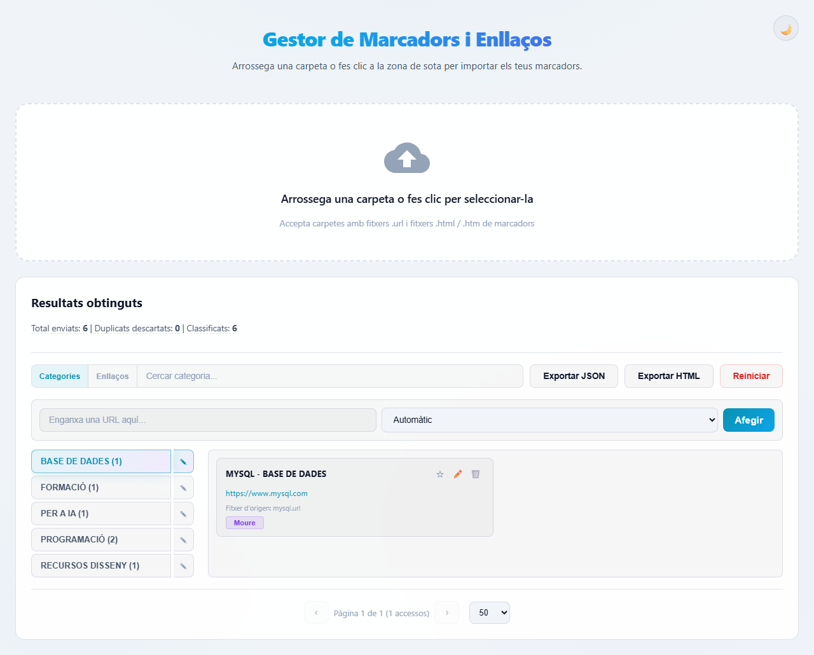
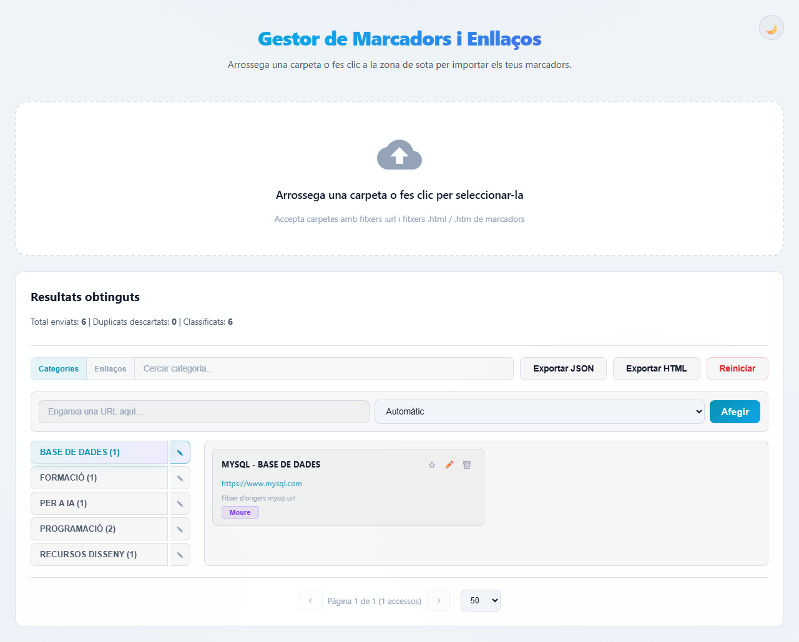
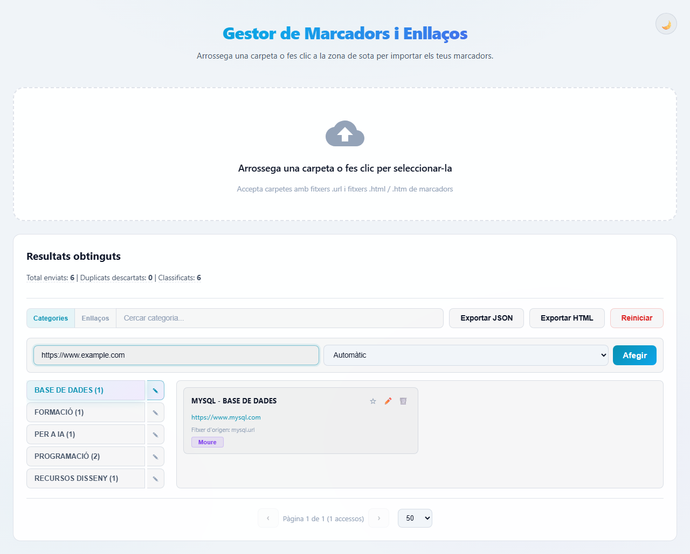
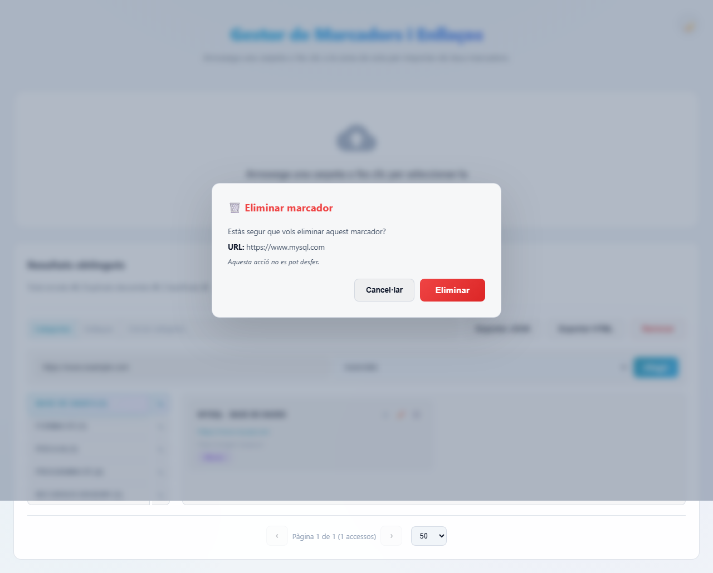

# Marcadors

> **Gestor de marcadors i enllaços amb classificació automàtica per categories.**

Aplicació web per importar, classificar i gestionar grans volums de marcadors (bookmarks). Arrossega una carpeta de fitxers `.url` o un fitxer `.html` d'exportació de marcadors i l'aplicació classifica automàticament cada enllaç en categories intel·ligents mitjançant paraules clau configurables.

---

## Captures de pantalla

> Les captures reflecteixen la versió actual. El disseny és fosc amb accents cian i porpra, inspirat en [tabularis.dev](https://tabularis.dev/).

| Pantalla principal | Classificació per categories |
|:---:|:---:|
|  |  |

| Barra d'afegir URL | Cerca d'enllaços |
|:---:|:---:|
|  |  |

---

## Funcionalitats

### Importació de marcadors
- **Arrossega i solta** una carpeta sencera amb fitxers `.url`
- **Importa fitxers HTML** d'exportació de marcadors (format Netscape)
- Processa milers de fitxers en segons
- Deduplica automàticament URLs repetides
- **Zona de descàrrega colapsable**: després de la primera importació, la zona d'arrossegament es contreu; fes clic per expandir-la de nou

### Classificació automàtica
- Cada URL s'analitza i es classifica en una categoria segons paraules clau
- Les categories es defineixen al fitxer `reglas.json`
- Sistema de ponderació: les paraules clau tenen pesos (`peso`) que determinen la categoria guanyadora
- El domini de la URL s'extreu automàticament per generar un nom llegible (`DOMINI - CATEGORIA`)

### Visualització i navegació
- **Capçalera de categoria**: en seleccionar una categoria, es mostra el nom, el nombre d'enllaços i la paginació (`‹ PÀG X de Y ›`)
- **Ordre alfabètic**: els enllaços s'ordenen automàticament per descripció (A-Z)
- **Data d'afegit**: cada enllaç mostra la data en què es va importar
- **Paginació intel·ligent**: en editar, moure o eliminar un enllaç, la categoria i pàgina actual es mantenen, sense reiniciar la navegació
- **Disseny responsive**: 2 columnes en escriptori, 1 columna en mòbil

### Gestió de marcadors
- **Moure entre categories**: arrossega un marcador directament a la categoria de destí, o usa el botó "Moure" i selecciona la categoria
- **Editar nom personalitzat**: canvia el nom generat automàticament per un nom personalitzat (es preserva encara que es renombre la categoria)
- **Eliminar marcadors**: esborra marcadors individuals amb confirmació prèvia
- **Marcadors favorits**: afegeix URLs a la categoria FAVORITS sense moure'ls de la seva categoria original; els favorits es mostren amb un ressal visual (franja groga)
- **Afegir URL manualment**: afegeix URLs individuals des de la barra superior, amb selecció de categoria o creació de categoria nova

### Categories
L'aplicació inclou desenes de categories predefinides amb centenars de paraules clau per a una classificació precisa. Les categories cobreixen: IA, programació, formació, bases de dades, disseny web, música, xarxes socials, lectures, eines, i moltes més. Consulta el fitxer `reglas.json` per a la llista completa.

### Cerca
- **Per categories**: filtra categories per nom
- **Per enllaços**: cerca a totes les categories per nom, URL o nom original

### Exportació
- **Exporta a JSON**: descarrega la classificació completa en format JSON
- **Exporta a HTML**: genera un fitxer HTML de marcadors compatible amb qualsevol navegador

### Temes
- **Mode fosc / clar**: alterna entre tema fosc i clar amb el botó ☀️/🌙
- **Al contrast**: detecta automàticament configuracions de contrast alt del sistema (`prefers-contrast: more`)
- **Transparència reduïda**: respecta la preferència `prefers-reduced-transparency`

### Altres
- Paginació configurable (20/50/100 elements per pàgina)
- Estadístiques en temps real: totals, duplicats, classificats
- Reinici complet de dades (amb confirmació)
- **Rate limiting**: 30 peticions/minut a l'API

---

## Tecnologies

- **Backend**: Node.js + Express 5
- **Frontend**: JavaScript natiu (ES modules), CSS modern (variables, dark/light mode, glassmorphism)
- **Base de dades**: Fitxer JSON (`datos_clasificados.json`)
- **Logging**: Pino (estructurat, amb pino-pretty per desenvolupament)
- **Rate limiting**: express-rate-limit (30 peticions/minut a l'API)
- **Testing**: Jest (25+ tests de classificació)

---

## Instal·lació

### Requisits
- Node.js 18 o superior
- npm

### Passos

```bash
# Clona el repositori
git clone https://github.com/MiquelMesa/marcadors.git
cd marcadors

# Instal·la dependències
npm install

# Inicia el servidor
npm start
```

Obre `http://localhost:3000` al teu navegador.

### Variables d'entorn (opcionals)

| Variable | Descripció | Per defecte |
|----------|------------|-------------|
| `PORT` | Port del servidor | `3000` |
| `BASE_PATH` | Ruta base on muntar l'aplicació | `/` |
| `PUBLIC_PATH` | Ruta pública per als assets (si difereix de BASE_PATH) | igual que BASE_PATH |
| `LOG_LEVEL` | Nivell de log (`info`, `debug`, `warn`, `error`) | `info` |
| `NODE_ENV` | Entorn (`development`, `production`) | (no definit = dev) |

---

## Desplegament amb PM2

L'aplicació inclou configuració per a PM2:

```bash
# Iniciar amb PM2
npm run pm2:start

# Aturar
npm run pm2:stop

# Veure logs
npm run pm2:logs
```

Per defecte, PM2 desplega a `http://localhost:3000/marcadores/`. Pots ajustar el port i la ruta a `ecosystem.config.js`.

### Reverse proxy (Nginx)

```nginx
server {
    listen 80;
    server_name elteudomini.com;

    location /marcadores/ {
        proxy_pass http://127.0.0.1:3000;
        proxy_http_version 1.1;
        proxy_set_header Upgrade $http_upgrade;
        proxy_set_header Connection 'upgrade';
        proxy_set_header Host $host;
        proxy_cache_bypass $http_upgrade;
    }
}
```

---

## Estructura del projecte

```
marcadors/
├── js/
│   ├── app.js          # Lògica principal de la UI
│   ├── api.js           # Comunicació amb el servidor (fetch API)
│   ├── ui.js            # Components UI, modals, renderitzat, paginació
│   └── lector.js        # Lectura de fitxers .url i .html
├── tests/
│   └── classificador.test.js  # Tests unitaris (Jest)
├── docs/
│   └── screenshots/     # Captures de pantalla
├── logs/                # Logs de PM2
│   └── .gitkeep
├── server.js            # Servidor Express (API + fitxers estàtics)
├── classificador.js     # Motor de classificació per paraules clau
├── logger.js            # Configuració de Pino
├── style.css            # Estils CSS (dark/light, responsive, glassmorphism)
├── index.html           # Pàgina principal
├── reglas.json          # Regles de classificació (categories + keywords)
├── reglas.default.json  # Còpia de seguretat de les regles
├── datos_clasificados.json  # Dades persistents (es genera automàticament)
├── ecosystem.config.js  # Configuració de PM2
├── package.json
├── LICENSE
└── README.md
```

---

## Personalització de les regles

El fitxer `reglas.json` conté totes les categories i paraules clau. Pots editar-lo manualment:

```json
{
  "categoria": "NOVA CATEGORIA",
  "keywords": [
    { "texto": "paraula", "peso": 3 },
    { "texto": "altra", "peso": 2 }
  ]
}
```

- **`categoria`**: nom de la categoria (es mostra en majúscules)
- **`keywords`**: llista de paraules clau associades
- **`texto`**: paraula o frase a buscar (en URL o nom de fitxer)
- **`peso`**: importància de la paraula (3 = alta, 2 = mitjana, 1 = baixa)

Les categories amb més pes acumulat determinen la classificació final.

### Restaurar regles per defecte

Per restaurar les regles al seu estat original, copia `reglas.default.json` sobre `reglas.json`.

---

## API REST

L'aplicació exposa una API REST per a operacions automatitzades:

| Mètode | Ruta | Descripció |
|--------|------|------------|
| `GET` | `/api/clasificacion-guardada` | Obté les dades classificades |
| `POST` | `/api/clasificar-url` | Classifica un lot d'URLs |
| `POST` | `/api/reclasificar` | Mou una URL a una altra categoria |
| `POST` | `/api/marcar-favorito` | Afegeix una URL a FAVORITS |
| `POST` | `/api/quitar-favorito` | Treu una URL de FAVORITS |
| `POST` | `/api/renombrar-categoria` | Renombra una categoria (preserva noms editats) |
| `DELETE` | `/api/eliminar` | Elimina una URL |
| `PUT` | `/api/editar-nombre` | Edita el nom personalitzat d'una URL |
| `GET` | `/api/exportar-html` | Exporta tot en format HTML de marcadors |
| `POST` | `/api/reiniciar` | Reinicia totes les dades |

### Canvis recents a l'API

- **`POST /api/clasificar-url`**: ara inclou `dataAlta` (timestamp ISO) a cada nova URL
- **`PUT /api/editar-nombre`**: marca la URL com a `nombreEditado: true` per preservar el nom personalitzat en futures operacions
- **`POST /api/renombrar-categoria`**: no regenera el nom de les URLs que han estat editades manualment

---

## Desenvolupament

### Tests

```bash
npm test
```

Executa 25 tests unitaris sobre el motor de classificació (`obtenerTematica`, `generarNombreNuevo`, `validarAccesos`).

### Linting

```bash
npm run lint
```

### Format

```bash
npm run format
```

---

## Llicència

MIT © [Miquel Mesa](https://github.com/MiquelMesa)
